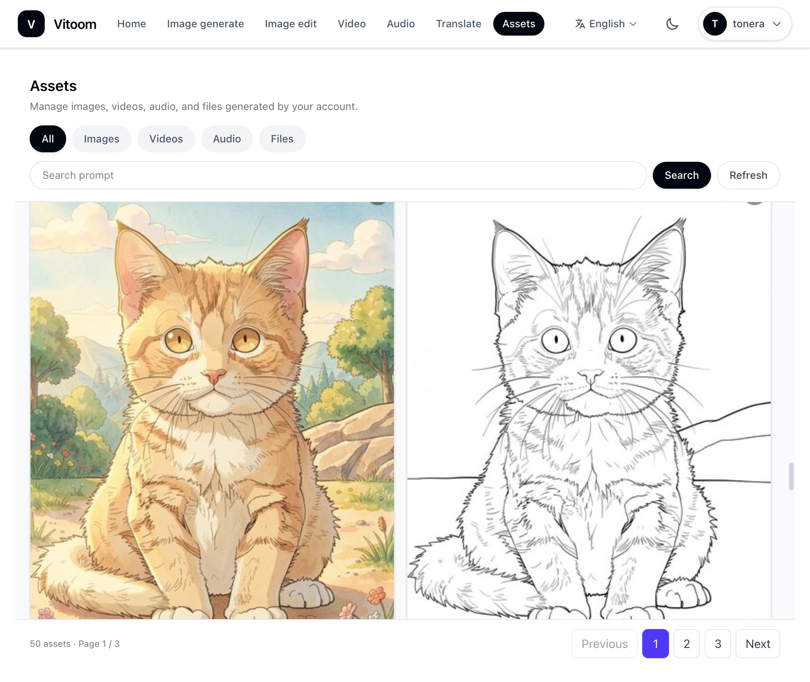

# Vitoom

**English** | [中文](README_CN.md) | [日本語](README_JP.md)

Vitoom is a **locally deployable AIGC application platform**. Access it through a browser to run text, image, audio, and video inference on your own machine (personal PCs with DGX Spark, RTX Spark, or RTX 30/40/50 series GPUs). A built-in **AI Agent** orchestrates writing, translation, document processing, knowledge-base retrieval, and multimodal generation. It suits solo creators and small teams on a LAN. If your work demands strict privacy—you cannot expose data or rely on cloud LLMs—Vitoom is built for that use case.



## Main use cases

| Area | Description |
| --- | --- |
| Writing & office | Documents, reports, summaries; copy ideation; export conversations to Markdown / PDF |
| Knowledge base | Archive PDF, Word, PPT, etc.; semantic search and Q&A; build a private knowledge base over time |
| Voice & audio | Text-to-speech (multi-speaker, voice design, cloning); multi-character dialogue / drama-style dubbing; speech-to-text |
| Image & video | Text-to-image (mainstream open models), image editing; image Q&A; text-to-video / image-to-video |
| Documents & OCR | Summarize and convert web / PDF / Office links; scan OCR (tables, formulas); export tables to Excel |
| Translation | Long-form multilingual translation; text-in-image translation |
| Web search | Optional live web search (requires a Tavily API key) |

## Requirements

- **Docker** and **Docker Compose** (`docker compose` subcommand)
- **Inference**: **NVIDIA GPU**, **NVIDIA driver with CUDA 13.0 support** (matches `cu130` inference images; check with `nvidia-smi`), and **NVIDIA Container Toolkit** (native Linux, or Docker Desktop + WSL2 on Windows)
- **Python 3.10+** to run `scripts/` setup and model download only (no full local inference stack required on the host)
- Network access to image/model sources (setup wizard **Mainland China** prefers domestic mirrors and ModelScope; **Other regions** mainly use Docker Hub / Hugging Face)

**Platforms**

| Platform | Notes |
| --- | --- |
| Linux | Native Docker recommended; run commands from the repository root |
| Windows | [Docker Desktop](https://www.docker.com/products/docker-desktop/) + **WSL2**; enable GPU and **File Sharing** for the project disk; run **Python scripts and `docker compose` in the same environment** (WSL2 terminal or PowerShell throughout—do not mix paths) |

Optional GPU / CUDA 13.0 runtime check (Docker installed and GPU passthrough working):

```bash
docker run --rm --gpus all nvidia/cuda:13.0.0-base-ubuntu24.04 nvidia-smi
```

## Windows Preparation

Windows users should complete the steps below first. Run the preparation commands in **PowerShell**. For the later installation steps, keep using the same environment: do not switch back and forth between PowerShell and a WSL terminal, or paths may not match.

**1. Open PowerShell**

Search for **PowerShell** in the Start menu and open it. First check that WSL is available:

```powershell
wsl --version
wsl -l -v
```

In the `wsl -l -v` output, check the `VERSION` column. The Linux distribution you use must be version `2`. If it shows `1`, switch it to WSL2:

```powershell
wsl --set-default-version 2
wsl --set-version <distribution-name> 2
```

Replace `<distribution-name>` with the name shown by `wsl -l -v`, for example `Ubuntu`.

**2. Install Git**

Git is required to download the Vitoom source code. Without Git, the later `git clone` command will fail.

```powershell
winget install --id Git.Git -e --source winget
```

**3. Install Python 3.11**

Python is required to run the setup wizard and download scripts under `scripts/`.

```powershell
winget install --id Python.Python.3.11 -e --source winget
```

**4. Reopen PowerShell**

After installing Git and Python, close the current PowerShell window and open a new one. Then verify the installation:

```powershell
git --version
py -3 --version
docker compose version
```

If all commands print version information, continue with “Quick install”.

## Quick install

First download the project code, then enter the project directory and run the install commands. Windows users should continue in the newly opened **PowerShell** window.

**1. Clone the project code**

```bash
git clone https://github.com/tonera/vitoom.git
cd vitoom
```

**2. Configure environment**

The setup wizard writes `.env`, detects `x86_64` / `aarch64`, and sets LAN URLs for inference. During configuration, note: **do not set `VITOOM_BACKEND_URL` to `127.0.0.1`**, or inference containers cannot reach the backend.

```bash
python scripts/setup_vitoom.py
```

On Windows PowerShell, if `python` is not found, replace later commands that start with `python` with `py -3`, for example:

```powershell
py -3 scripts/setup_vitoom.py
```

**3. Load images**

```bash
python scripts/load_vitoom_images.py
```

Loads offline tar from `images/<arch>/` when present, otherwise pulls from Docker Hub. Partial components example:

```bash
python scripts/load_vitoom_images.py --components backend,visual,text
```

**4. Start services**

Start **backend first** (creates Docker network `vitoom-net`), then inference:

```bash
docker compose up -d backend
```

Start inference profiles selected in the wizard (full stack below—**one line**, because Windows CMD does not support `\` line continuation):

```bash
docker compose -f docker-compose.inference.release.yml --profile visual --profile text --profile audio --profile mini --profile download up -d
```

Subset example (image + text only):

```bash
docker compose -f docker-compose.inference.release.yml --profile visual --profile text up -d
```

Open in browser: `http://<LAN-IP>:8888` (see `VITOOM_BACKEND_URL` / `VITOOM_SERVER_PORT` in `.env`; you may use `127.0.0.1` in the browser locally, but `.env` should still use the LAN IP).

**5. Download models (optional, large)**

```bash
python scripts/download_initial_models.py
```

Or download later under **Models** in the Web UI (requires the `download` profile). For a first try, at least start backend + text and download an LLM.

More detail: [`docker-usage-en.md`](docker-usage-en.md) ([中文](docker-usage-cn.md) / [日本語](docker-usage-jp.md)).

## Usage

1. **Sign in**: Open `http://<LAN-IP>:8888` in a browser; the default admin after first deploy is `admin@vitoom.ai` with initial password `admin123456` (same as `DEFAULT_ADMIN_PASSWORD` in `.env`). **Change this password immediately after first login.** Administrators can add more users in the Web admin UI.
2. **Agent**: Chat in natural language for writing, translation, documents, knowledge base, image/audio/video generation (tools are chosen automatically).
3. **Workspaces**: Home → **Image**, **Video**, **Audio** (ASR/TTS), **Translate**, etc.
4. **Models**: Download and activate weights in the model list; needs the `download` profile or step 5 script.
5. **Knowledge base**: Archive files or conversations, then query via Agent.
6. **Web search (optional)**: Set `TAVILY_API_KEY` in `.env` ([Tavily](https://www.tavily.com/)).

First inference startup can be slow (loading weights). Logs:

```bash
docker compose logs -f backend
docker compose -f docker-compose.inference.release.yml logs -f visual
```

## Related docs

| Doc | Description |
| --- | --- |
| [`docker-usage-en.md`](docker-usage-en.md) | Docker deployment, profiles, data dirs, troubleshooting |
| [`docker-usage-jp.md`](docker-usage-jp.md) | Same guide in Japanese |
| [`docker-usage-cn.md`](docker-usage-cn.md) | Same guide in Chinese |

## Acknowledgments

- [TurboDiffusion](https://github.com/thu-ml/TurboDiffusion) — fast video inference
- [Nunchaku](https://github.com/nunchaku-ai/nunchaku) — image inference acceleration
- [Qwen3-TTS](https://github.com/QwenLM/Qwen3-TTS) — speech synthesis
- [Qwen3-ASR](https://github.com/QwenLM/Qwen3-asr) — speech recognition
- [VoxCPM](https://voxcpm.readthedocs.io/) — fast speech synthesis
- [vLLM](https://github.com/vllm-project/vllm) — efficient text inference
- [RMBG-2.0](https://github.com/Bria-AI/RMBG-2.0) — background removal
- [MeanCache](https://github.com/UnicomAI/MeanCache) — image inference acceleration

## License

This project is licensed under the [GNU Affero General Public License v3.0](LICENSE) (AGPL-3.0). Commercial licensing: [COMMERCIAL_LICENSE.md](COMMERCIAL_LICENSE.md) (if applicable).

Upstream models and third-party components have their own licenses—verify compliance before use.
